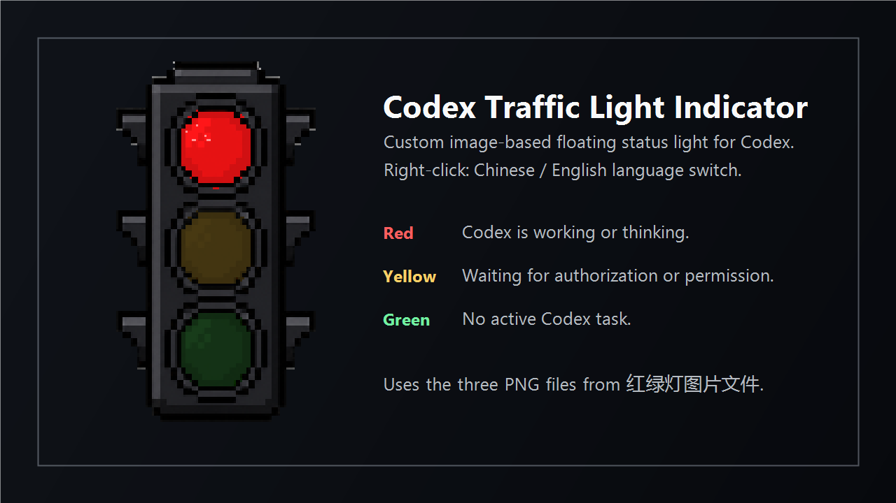

# Codex 红绿灯提示灯 / Codex Traffic Light Indicator



## 中文介绍

Codex 红绿灯提示灯是一个 Windows 桌面悬浮窗插件，用红、黄、绿三种灯色显示 Codex 当前状态。悬浮窗小巧、置顶、可拖动，没有系统窗口边框，背景透明，只保留红绿灯图案和状态文字。

- 红灯：Codex 正在处理任务、思考、执行命令、读取文件或测试。
- 黄灯：Codex 正在等待你的授权、权限确认或审批。
- 绿灯：没有正在进行的 Codex 对话任务，处于空闲状态。
- 连接文字：检测本机 Codex 进程，显示 `Codex：已成功连接` 或 `Codex：等待连接`。
- 语言切换：在悬浮窗上右键，选择 `语言 / Language`，可以切换中文或英文。
- 图案资源：悬浮窗使用 `assets/traffic-light-red.png`、`assets/traffic-light-yellow.png`、`assets/traffic-light-green.png` 三张图片切换状态。

## 一键安装

下载项目后，双击根目录里的：

```bat
一键安装.bat
```

安装脚本会自动复制程序文件、生成本地 MCP 配置、写入 Codex 个人 marketplace、创建桌面启动快捷方式，并启动一次悬浮窗。

默认安装目录：

```text
D:\codex红绿灯提示灯
```

如果电脑没有 D 盘，会安装到：

```text
%USERPROFILE%\plugins\codex-traffic-light
```

## 一键卸载

双击根目录里的：

```bat
一键卸载.bat
```

卸载脚本会停止悬浮窗、删除桌面快捷方式、移除 Codex marketplace 条目，并删除默认安装目录。

## 手动启动和测试

安装完成后，可以双击桌面快捷方式：

```text
启动Codex红绿灯提示灯
```

也可以运行测试脚本检查灯色：

```bat
scripts\test_set_red.bat
scripts\test_set_yellow.bat
scripts\test_set_green.bat
```

真实工作状态由悬浮窗扫描本机 Codex 会话事件和授权请求来判断；测试脚本只用于确认显示效果。

## English Introduction

Codex Traffic Light Indicator is a small Windows floating-window plugin for Codex. It shows Codex status with a traffic-light style indicator and a short connection line. The window is always on top, draggable, frameless, and transparent around the traffic light and text.

- Red: Codex is working, thinking, running commands, reading files, or testing.
- Yellow: Codex is waiting for authorization, permission, or approval.
- Green: No active Codex conversation task is running.
- Connection text: detects the local Codex process and shows `Codex connected` or `Codex waiting`.
- Language switch: right-click the floating window, open `Language / 语言`, and choose Chinese or English.
- Image assets: the floating window switches between `assets/traffic-light-red.png`, `assets/traffic-light-yellow.png`, and `assets/traffic-light-green.png`.

## One-Click Install

After downloading the project, double-click:

```bat
一键安装.bat
```

The installer copies the files, generates local MCP configuration, registers the plugin in the Codex personal marketplace, creates a desktop launcher, and starts the floating window once.

Default install location:

```text
D:\codex红绿灯提示灯
```

If drive D is unavailable, it installs to:

```text
%USERPROFILE%\plugins\codex-traffic-light
```

## One-Click Uninstall

Double-click:

```bat
一键卸载.bat
```

The uninstaller stops the floating window, removes the desktop shortcut, removes the Codex marketplace entry, and deletes the default install directory.

## Codex Integration

Plugin name:

```text
codex-traffic-light
```

The local MCP server writes the shared status file:

```text
D:\codex红绿灯提示灯\state\status.json
```

The floating window reads this file and also watches local Codex session events so red and yellow can update automatically during normal Codex use.
